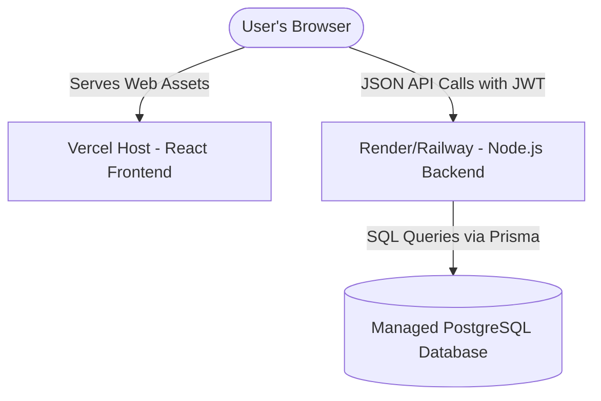

# Share Bill — Production Deployment Guide

This document describes how to deploy the Share Bill application to production. The stack consists of a React client built with Vite (deployed to Vercel) and an Express API server utilizing Prisma and PostgreSQL (deployed to Render or Railway).

---

## Architecture Overview



---

## 1. Backend Deployment (Render / Railway)

### Database Provisioning
Before deploying the Express server, you must have a running PostgreSQL database. You can provision one via Railway, Render, Supabase, Neon, or AWS RDS.
Once created, retrieve the database connection string. It must match the format:
`postgresql://<username>:<password>@<host>:<port>/<database_name>?schema=public`

### Option A: Deploying on Render
1. Sign in to [Render](https://render.com) and click **New > Web Service**.
2. Connect your GitHub repository containing the project.
3. Configure the following service settings:
   - **Root Directory**: `backend`
   - **Runtime**: `Node`
   - **Build Command**: `npm install && npm run build`
   - **Start Command**: `npm start`
4. Add the required environment variables (see [Environment Variables](#environment-variables-template) below).
5. (Optional) In the Web Service settings, configure a health check path pointing to: `/api/health`.

### Option B: Deploying on Railway
1. Sign in to [Railway](https://railway.app) and select **New Project**.
2. Select **Deploy from GitHub repository** and connect your repository.
3. Once the service is added, navigate to its settings and configure:
   - **Root Directory**: `backend`
   - **Build Command**: `npm install && npm run build`
   - **Start Command**: `npm start`
4. Add environment variables under the **Variables** tab.

### Database Schema Migrations
Prisma requires running migration deployment to create the database schemas.
- Locally, you run `npm run prisma:migrate` which triggers `prisma migrate dev`.
- **In Production**, you must run `npm run db:migrate` which executes `prisma migrate deploy` to safely apply migrations without interactive prompts or database resets.
- You can run this command locally pointing to the production database before deployment, or configure Render/Railway to run the migrations as part of a release phase or pre-start step:
  - Render pre-start command: `npm run db:migrate && npm start`
  - Railway release step: `npm run db:migrate`

---

## 2. Frontend Deployment (Vercel)

1. Sign in to [Vercel](https://vercel.com) and click **Add New > Project**.
2. Connect your GitHub repository.
3. Configure project settings:
   - **Framework Preset**: `Vite` (Vercel automatically detects this).
   - **Root Directory**: `frontend`
   - **Build Command**: `npm run build`
   - **Output Directory**: `dist`
4. Under **Environment Variables**, add:
   - `VITE_API_URL`: The full URL of your deployed backend (e.g. `https://share-bill-api.onrender.com`).
5. Click **Deploy**.

### React Router Routing Rewrite
Because React Router manages path-based navigation in the browser (Single Page Application), hitting a route like `/activities` directly will cause a Vercel 404 error. To resolve this, a `vercel.json` configuration file is placed in the `frontend` directory:
```json
{
  "cleanUrls": true,
  "rewrites": [
    {
      "source": "/(.*)",
      "destination": "/index.html"
    }
  ]
}
```
This forces Vercel to route all custom browser requests back to `index.html` where React Router handles the route rendering.

---

## Environment Variables Template

### Backend Production Configuration (`.env`)
```ini
# Server Configuration
PORT=5000
NODE_ENV=production

# Database Configuration (PostgreSQL with Prisma)
# Must start with postgresql:// or postgres://
DATABASE_URL="postgresql://db_user:db_password@db_host:5432/db_name?schema=public"

# Authentication Config
# Use a highly secure, random, secret key
JWT_SECRET="secure_random_production_secret_key"
JWT_EXPIRES_IN="7d"

# CORS Setup
# Set to your Vercel frontend app URL (separate multiple by commas)
CORS_ORIGIN="https://share-bill-app.vercel.app"
```

### Frontend Production Configuration (`.env`)
```ini
# Production API Base URL (must point to backend without trailing slash)
VITE_API_URL="https://share-bill-api.onrender.com"
```

---

## Deployment Checklist

### Pre-Deployment Checklist
- [ ] Database credentials verified and database is accessible.
- [ ] Production frontend URL is determined for backend `CORS_ORIGIN` setup.
- [ ] Environment variables configured correctly on host providers (Render/Railway and Vercel).
- [ ] Strong `JWT_SECRET` generated for production (do not use dev default).

### Deployment Steps
- [ ] Run backend build (`npm install && npm run build` inside `backend/`).
- [ ] Execute database migrations using `npm run db:migrate` (runs `prisma migrate deploy`).
- [ ] Deploy backend service and confirm it starts successfully.
- [ ] Build and deploy frontend service on Vercel.

### Post-Deployment Verification
- [ ] Access the backend health check at `https://your-backend-url.onrender.com/api/health` and verify the output:
  ```json
  {
    "status": "UP",
    "timestamp": "2026-06-15T01:00:00.000Z",
    "services": {
      "database": "UP",
      "api": "UP"
    }
  }
  ```
- [ ] Open the Vercel frontend URL. Test:
  - [ ] User Registration and User Login.
  - [ ] Group Creation.
  - [ ] Expense Add/Edit/Delete actions.
  - [ ] CSV import page and anomaly list screens.
  - [ ] Activity log timeline updates.
- [ ] Inspect browser DevTools network tab to ensure CORS policy passes and JWT cookies/headers are successfully included.
- [ ] Trigger an invalid request or login error and verify that no server stack traces are leaked in responses.
