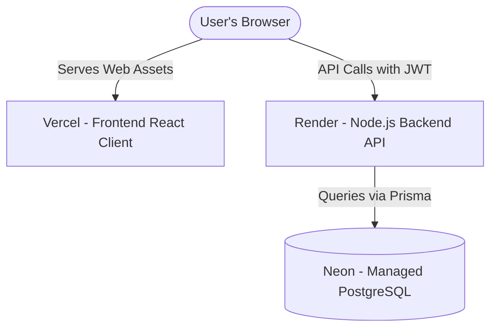

# ShareBill - Production Deployment Guide

This guide describes how I deployed the ShareBill application to production. The frontend runs on Vercel, the backend API runs on Render, and the database runs on Neon PostgreSQL.

---

## Architecture Flow



---

## 1. Database Setup (Neon PostgreSQL)

1. Sign up for a free account at [Neon](https://neon.tech/).
2. Create a new project, name it, and choose a region close to your target users.
3. Copy the database connection string from your Neon dashboard. It will look like this:
   `postgresql://<username>:<password>@<host>/dbname?sslmode=require`
4. Set this connection string aside. You will need to paste it as the `DATABASE_URL` environment variable on Render.

---

## 2. Backend Deployment (Render)

1. Sign in to [Render](https://render.com) and link your GitHub repository.
2. Click **New > Web Service**.
3. Set the service configuration fields:
   * **Root Directory:** `backend`
   * **Runtime:** `Node`
   * **Build Command:** `npm install && npm run build`
   * **Start Command:** `npx prisma migrate deploy && npm start`
4. Expand the **Advanced** settings panel and configure the **Health Check Path** to:
   `/api/health`
5. Go to the **Environment Variables** section and add the following keys:

| Variable Name | Recommended Value / Description |
| :--- | :--- |
| `DATABASE_URL` | The PostgreSQL connection string you copied from Neon. |
| `JWT_SECRET` | A secure, random string used to sign authentication tokens. |
| `NODE_ENV` | `production` |
| `CORS_ORIGIN` | Your Vercel frontend deployment URL (e.g. `https://sharebill.vercel.app`). |

*Note: Render automatically injects the `PORT` variable (default is 10000) so you do not need to set it.*

---

## 3. Frontend Deployment (Vercel)

1. Sign in to [Vercel](https://vercel.com) and click **Add New > Project**.
2. Select your GitHub repository.
3. Configure the Vite build settings:
   * **Framework Preset:** `Vite` (auto-detected)
   * **Root Directory:** `frontend`
   * **Build Command:** `npm run build`
   * **Output Directory:** `dist`
4. Under **Environment Variables**, add the API target URL:
   * `VITE_API_URL`: The URL of your Render backend API service (e.g. `https://sharebill-api.onrender.com/api`).
5. Click **Deploy**.

### React Router SPA Routing
Since React Router handles page transitions on the client side, Vercel needs to direct all route traffic back to `index.html`. This is done using a `vercel.json` file inside the `frontend` folder:
```json
{
  "cleanUrls": true,
  "rewrites": [
    {
      "source": "/(.*)",
      "destination": "/index.html"
    }
  ]
}
```

---

## 4. Verification Checklist

* **Backend Health Check:** Open `https://your-backend.onrender.com/api/health` in a browser. It should show a JSON response confirming that the server and database are both `UP`.
* **Database Migrations:** Ensure that tables were successfully created in Neon by looking at the Prisma migration logs during Render start-up.
* **CORS Access:** Log in to the Vercel frontend, create a group, and check the browser DevTools console to ensure requests aren't blocked by CORS policies.
