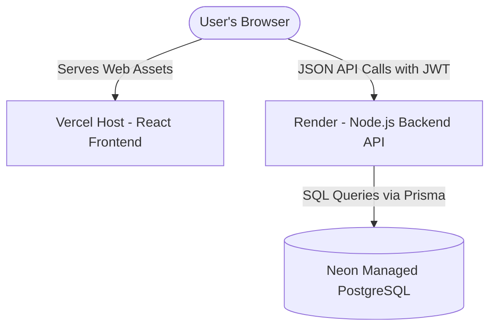

# Share Bill — Production Deployment Guide (Render)

This document describes how to deploy the Share Bill backend API to **Render** with a managed **PostgreSQL** database (e.g. Neon) and the Vite frontend to **Vercel**.

---

## Architecture Overview



---

## 1. Backend Deployment (Render)

### Prerequisites
1. A managed PostgreSQL database (e.g., [Neon](https://neon.tech/)).
2. Retrieve your database connection string in the format:
   `postgresql://<username>:<password>@<host>/<dbname>?sslmode=require`

### Render Setup Steps
1. Sign in to [Render](https://render.com) and click **New > Web Service**.
2. Connect your GitHub repository containing the project.
3. Configure the following service settings:
   - **Root Directory**: `backend`
   - **Runtime**: `Node`
   - **Build Command**: `npm install && npm run build`
   - **Start Command**: `npx prisma migrate deploy && npm start`
4. Add the required [Environment Variables](#environment-variables-on-render).
5. In the Web Service settings under **Advanced**, configure the Health Check Path to:
   `/api/health`

---

## Environment Variables on Render

Configure the following key-value pairs in the **Environment Variables** section of your Render Web Service:

| Variable Name | Recommended Value / Description |
| :--- | :--- |
| `DATABASE_URL` | The PostgreSQL connection string retrieved from Neon/PostgreSQL. |
| `JWT_SECRET` | A secure, random, long secret string for signing authentication tokens. |
| `NODE_ENV` | Set to `production` |
| `CORS_ORIGIN` | Your Vercel frontend production URL (e.g., `https://share-bill-app.vercel.app`). |
| `PORT` | *Automatically injected by Render (normally 10000)* |

---

## 2. Frontend Deployment (Vercel)

1. Sign in to [Vercel](https://vercel.com) and click **Add New > Project**.
2. Connect your GitHub repository.
3. Configure project settings:
   - **Framework Preset**: `Vite` (Vercel automatically detects this).
   - **Root Directory**: `frontend`
   - **Build Command**: `npm run build`
   - **Output Directory**: `dist`
4. Under **Environment Variables**, add:
   - `VITE_API_URL`: The full URL of your deployed Render backend (e.g. `https://share-bill-api.onrender.com`).
5. Click **Deploy**.

### React Router Single Page Application Routing
Because React Router manages browser paths on the client side, Vercel needs rewrite configuration to mapping all paths back to `index.html`. A `vercel.json` file is configured in the `frontend` directory:
```json
{
  "cleanUrls": true,
  "rewrites": [
    {
      "source": "/(.*)",
      "destination": "/index.html"
    }
  ]
}
```

---

## Deployment Checklist

### Pre-Deployment Tasks
- [ ] Neon PostgreSQL database URL obtained.
- [ ] Strong random string generated for production `JWT_SECRET`.
- [ ] Vercel frontend URL decided and ready to supply to backend `CORS_ORIGIN`.
- [ ] Node.js version 20 compatibility engines configured in `package.json`.

### Deployment Steps
- [ ] Trigger the build on Render.
- [ ] Verify that **Build Command** (`npm install && npm run build`) executes `npx prisma generate` successfully without permission errors.
- [ ] Verify that **Start Command** (`npx prisma migrate deploy && npm start`) executes PostgreSQL migrations on Neon and starts the server.
- [ ] Deploy the frontend on Vercel with the backend URL set as `VITE_API_URL`.

### Post-Deployment Verification
- [ ] Access the backend health check at `https://your-backend.onrender.com/api/health` and verify database and API report `UP`.
- [ ] Open the Vercel app in the browser and test user authentication, group management, and expense splitting workflows.
