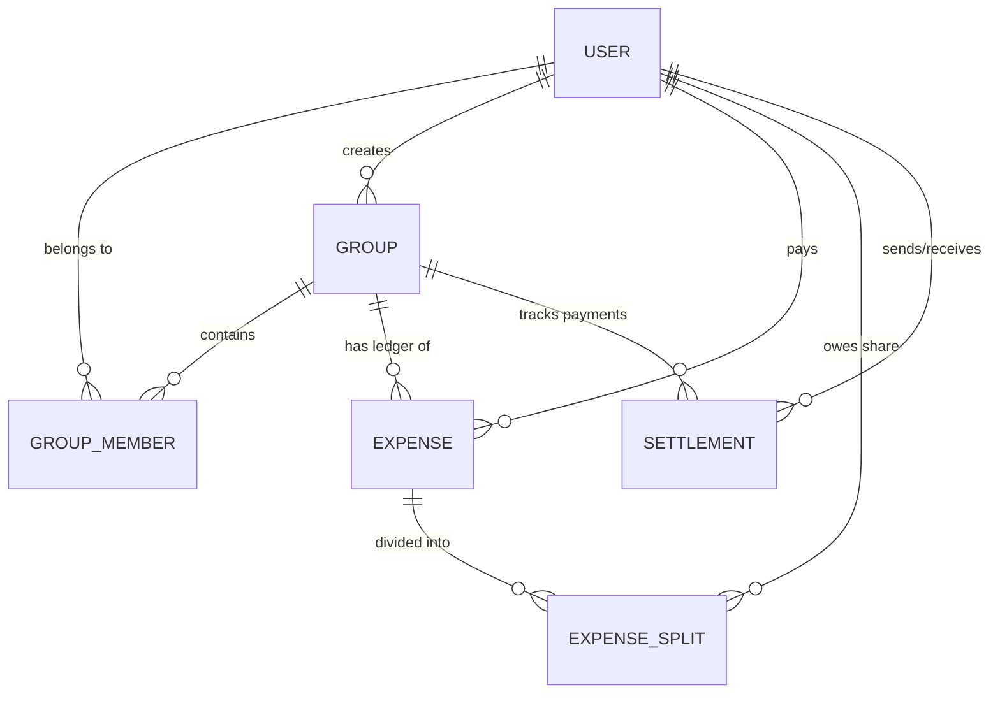

# ShareBill - Anomaly Scope & Database Schema Specifications

This document defines the data validation boundaries, CSV anomaly categorization engine, and the underlying PostgreSQL database schema designed for the ShareBill expense sharing application.

---

## 1. CSV Data Quality Anomaly Log & Resolution Policies

The CSV Import Engine runs a comprehensive validation pipeline checking for syntax, integrity, constraints, and duplicates. It classifies issues into 13 distinct anomaly categories, structured under 4 severity levels:
* **CRITICAL**: Rejects the row. Import is blocked for this row until resolved.
* **REVIEW_REQUIRED**: Row is suspended and highlighted. Import requires manual choice/approval from the user.
* **WARNING**: Informational check. Row is allowed but flagged (e.g. creating guest profiles).
* **AUTO_FIXED**: Corrected automatically by the engine and logged.

### Anomaly Mappings (13 Issue Types)

| # | Anomaly Type | Severity | Detection Rule | Auto-Fix Logic | Manual User Resolution Options |
| :--- | :--- | :--- | :--- | :--- | :--- |
| **1** | `DUPLICATE_EXPENSE` | WARNING | Exact duplicate of an existing DB expense: same date, same amount, same payer (ID), same description. | None | **Keep Existing** (skips row) / **Import New** / **Keep Both** |
| **2** | `NEAR_DUPLICATE` | WARNING | Same amount, same payer, description similarity score > 85% (Levenshtein Distance calculation). | None | **Keep Existing** (skips row) / **Import New** / **Keep Both** |
| **3** | `AMBIGUOUS_DATE` | REVIEW_REQUIRED | Date string uses separators (e.g. `04-05-2026`) and both Day & Month values are $\le 12$ and unequal. | Flagged for review; defaults to interpreting as **DD-MM-YYYY**. | Choose **Interpret as DD-MM-YYYY** / **Interpret as MM-DD-YYYY** |
| **4** | `UNKNOWN_MEMBER` | WARNING | Payer (`paid_by`) is not currently a member of the group. | Suggests **Create Guest Member** (auto-assigned dummy email). | Choose **Create Guest Member** / **Map to Existing Group Member** dropdown |
| **5** | `UNKNOWN_PARTICIPANT` | WARNING | Participant listed in `split_with` column is not a member of the group. | Suggests **Create Guest Member**. | Choose **Create Guest Member** / **Map to Existing Group Member** dropdown |
| **6** | `LIFECYCLE_VIOLATION` | WARNING | Expense date occurs before member's `joinedAt` date, or after their `leftAt` exit date. | Flagged for review; allows historical ledger data exceptions. | **Approve lifecycle timeline violation** / **Skip Row** |
| **7** | `EQUAL_SPLIT_CONFLICT` | REVIEW_REQUIRED | Split type is designated as `EQUAL` but custom split details are provided in the CSV cell. | Flags conflict. | Choose **Ignore details (Split Equally)** / **Convert to SHARE based splits** |
| **8** | `INVALID_PERCENTAGE_SPLIT` | CRITICAL | Split type is `PERCENTAGE` but shares do not sum to exactly 100% (within 0.05% delta). | None (blocks direct db save). | **Scale/Normalize proportionally to 100%** / **Skip Row** / **Edit splits manually** |
| **9** | `INVALID_EXACT_SPLIT` | CRITICAL | Split type is `EXACT` but specified monetary shares do not sum to the total expense amount. | None (blocks save). | **Scale/Normalize exact splits** / **Skip Row** / **Edit manually** |
| **10** | `NEGATIVE_AMOUNT` | WARNING | Expense amount entered is less than zero (e.g. `-120.00`). | Converts amount to **positive absolute value** and flags as a **Refund**. | **Accept Refund Conversion** / **Skip Row** |
| **11** | `REFUND_DETECTED` | WARNING | Description contains refund keywords ("refund", "reimbursement") and/or amount is negative. | Converts negative amount to absolute and flags type as refund. | **Import as Refund** / **Convert to Settlement** |
| **12** | `SETTLEMENT_DETECTED` | REVIEW_REQUIRED | Description matches settlement patterns ("paid back", "settled", "refund transfer", "payment to"). | Flagged. Suggests converting Expense row to a **Settlement** record. | **Convert from Expense to Settlement** / **Keep as standard Expense** |
| **13** | `MULTIPLE_CURRENCIES` | WARNING | Expense currency code (e.g. `INR`) differs from default group base currency (e.g. `USD`). | Preserves the original currency code; database records amounts in original currency. | **Preserve original currency** / **Convert to default group currency** |

---

## 2. Database Schema Design (Prisma PostgreSQL)

ShareBill utilizes Prisma ORM to model the relational architecture, targeting a PostgreSQL instance. The schema tracks users, group memberships, expense allocations, cash settlements, and file upload validation logs.

### Entity-Relationship Diagram



### Prisma Schema Source File (`schema.prisma`)

```prisma
datasource db {
  provider = "postgresql"
  url      = env("DATABASE_URL")
}

generator client {
  provider = "prisma-client-js"
}

enum SplitType {
  EQUAL
  PERCENTAGE
  EXACT
  SHARE
}

enum AnomalySeverity {
  LOW
  MEDIUM
  HIGH
}

model User {
  id                  String         @id @default(uuid())
  email               String         @unique
  name                String
  password            String
  avatarUrl           String?
  createdAt           DateTime       @default(now())
  updatedAt           DateTime       @updatedAt
  
  // Relations
  groups              GroupMember[]
  createdGroups       Group[]        @relation("GroupCreator")
  expensesPaid        Expense[]      @relation("ExpensePayer")
  splits              ExpenseSplit[]
  sentSettlements     Settlement[]   @relation("SettlementSender")
  receivedSettlements Settlement[]   @relation("SettlementReceiver")
}

model Group {
  id          String        @id @default(uuid())
  name        String
  description String?
  creatorId   String
  createdAt   DateTime      @default(now())
  updatedAt   DateTime      @updatedAt

  // Relations
  creator     User          @relation("GroupCreator", fields: [creatorId], references: [id], onDelete: Cascade)
  members     GroupMember[]
  expenses    Expense[]
  settlements Settlement[]
}

model GroupMember {
  id        String    @id @default(uuid())
  groupId   String
  userId    String
  joinedAt  DateTime  @default(now())
  leftAt    DateTime?

  // Relations
  group     Group     @relation(fields: [groupId], references: [id], onDelete: Cascade)
  user      User      @relation(fields: [userId], references: [id], onDelete: Cascade)

  @@unique([groupId, userId])
}

model Expense {
  id          String         @id @default(uuid())
  description String
  amount      Float
  currency    String         @default("USD")
  date        DateTime       @default(now())
  groupId     String
  paidById    String
  splitType   SplitType      @default(EQUAL)
  createdAt   DateTime       @default(now())
  updatedAt   DateTime       @updatedAt

  // Relations
  group       Group          @relation(fields: [groupId], references: [id], onDelete: Cascade)
  paidBy      User           @relation("ExpensePayer", fields: [paidById], references: [id], onDelete: Cascade)
  splits      ExpenseSplit[]
}

model ExpenseSplit {
  id         String   @id @default(uuid())
  expenseId  String
  userId     String
  amount     Float    // Computed exact monetary amount split
  percentage Float?   // Used if splitType is PERCENTAGE
  shares     Float?   // Used if splitType is SHARE (e.g. 1 share, 2 shares)

  // Relations
  expense    Expense  @relation(fields: [expenseId], references: [id], onDelete: Cascade)
  user       User     @relation(fields: [userId], references: [id], onDelete: Cascade)

  @@unique([expenseId, userId])
}

model Settlement {
  id          String   @id @default(uuid())
  groupId     String
  fromUserId  String
  toUserId    String
  amount      Float
  date        DateTime @default(now())
  createdAt   DateTime @default(now())

  // Relations
  group       Group    @relation(fields: [groupId], references: [id], onDelete: Cascade)
  fromUser    User     @relation("SettlementSender", fields: [fromUserId], references: [id], onDelete: Cascade)
  toUser      User     @relation("SettlementReceiver", fields: [toUserId], references: [id], onDelete: Cascade)
}

model ImportAnomaly {
  id          String          @id @default(uuid())
  fileName    String
  severity    AnomalySeverity
  anomalyType String
  message     String
  rowNumber   Int?
  createdAt   DateTime        @default(now())
}
```

### Table Columns Description & Keys

1. **User**: Stores registered user credentials. Emails are unique and index-optimized.
2. **Group**: Tracks expense group details. The `creatorId` references the owner with cascade delete.
3. **GroupMember**: Stores group membership linkages. Implements a unique composite key `@@unique([groupId, userId])` to prevent duplicate membership registers. Supports `joinedAt` (defaulting to creation) and a nullable `leftAt` column representing a member's exit timestamp.
4. **Expense**: Stores basic expense records. `paidById` references the paying User; `groupId` links the target group. Split calculations read these fields to trace net group standing balances.
5. **ExpenseSplit**: Breaks down the individual split amounts. Features nullable helper columns (`percentage`, `shares`) depending on the `splitType` settings of the parent expense. Links to specific Users and Expenses with composite unique constraints `@@unique([expenseId, userId])`.
6. **Settlement**: Records cash-out flow receipts. Links paying sender (`fromUserId`) and recipient (`toUserId`) to track balance offset.
7. **ImportAnomaly**: Retains historical logs of files parsed, warning types, and row triggers.
